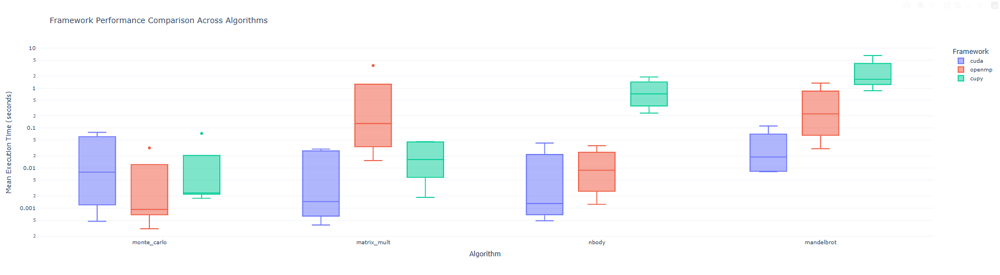
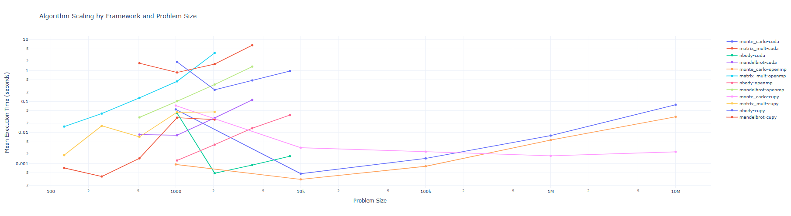
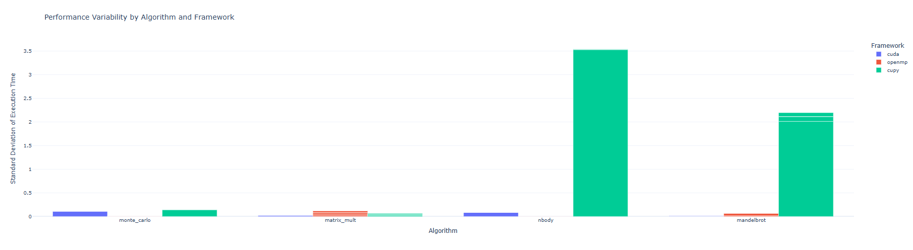
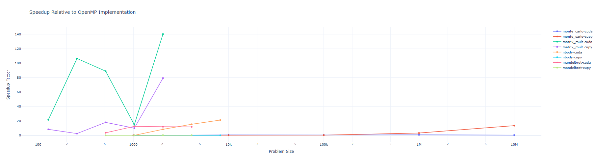
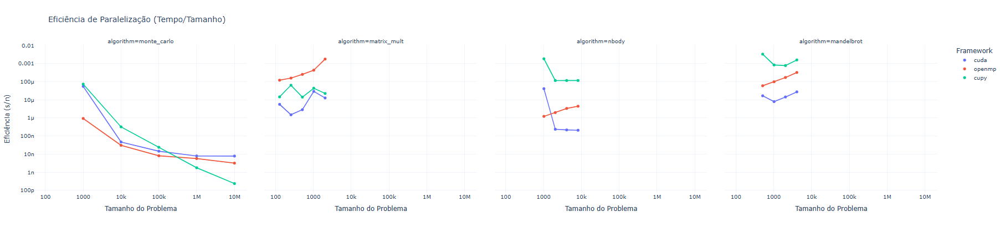

# Parallel Computing Benchmark Suite

A comprehensive benchmarking suite comparing CUDA, OpenMP, and CuPy implementations of common parallel computing algorithms.

## Benchmark Visualizations

### Framework Performance Comparison

*Comparison of execution times across different frameworks and algorithms*

### Scaling Analysis

*How execution time scales with problem size for each implementation*

### Performance Variability

*Standard deviation of execution times showing stability of each framework*

### Speedup Analysis

*Relative speedup compared to OpenMP baseline implementation*

### Parallelization Efficiency


## Algorithms Implemented
- Monte Carlo Pi Estimation
- Matrix Multiplication
- N-Body Simulation
- Mandelbrot Set Generation

## System Requirements
- CUDA-capable GPU (Tested on NVIDIA RTX 3080 Ti)
- OpenMP-compatible C++ compiler
- Python 3.8+
- CuPy with CUDA support

## Hardware Used in Benchmarks
```
CPU: Intel Xeon E5-2680 v4 @ 2.40GHz (14 cores, 28 threads)
GPU: NVIDIA GeForce RTX 3080 Ti (12GB VRAM)
RAM: 64GB
OS: Ubuntu Linux
```

## Installation

```bash
# Clone repository
git clone https://github.com/yourusername/parallel-benchmark-suite.git
cd parallel-benchmark-suite

# Install Python dependencies
pip install -r requirements.txt

# Compile CUDA implementations
cd cuda
nvcc -O3 -shared -Xcompiler -fPIC monte_carlo.cu -o libmonte_carlo.so
nvcc -O3 -shared -Xcompiler -fPIC matrix_mult.cu -o libmatrix_mult.so
nvcc -O3 -shared -Xcompiler -fPIC nbody.cu -o libnbody.so
nvcc -O3 -shared -Xcompiler -fPIC mandelbrot.cu -o libmandelbrot.so

# Compile OpenMP implementations
cd ../openmp
g++ -O3 -fopenmp -shared -fPIC monte_carlo.cpp -o libmonte_carlo.so
g++ -O3 -fopenmp -shared -fPIC matrix_mult.cpp -o libmatrix_mult.so
g++ -O3 -fopenmp -shared -fPIC nbody.cpp -o libnbody.so
g++ -O3 -fopenmp -shared -fPIC mandelbrot.cpp -o libmandelbrot.so
```

## Usage

```bash
python3 benchmark/benchmark.py
```

## Key Findings

1. **Monte Carlo Pi Estimation**
   - Best performance: CuPy (1M points: ~0.0017s)
   - CUDA: ~0.0079s
   - OpenMP: ~0.0056s

2. **Matrix Multiplication (2048x2048)**
   - Best performance: CUDA (~0.026s)
   - OpenMP: ~3.64s
   - CuPy: ~0.046s

3. **N-Body Simulation (4096 bodies)**
   - Best performance: CUDA (~0.00089s)
   - OpenMP: ~0.014s
   - CuPy: ~0.24s

4. **Mandelbrot Set (4096x4096)**
   - Best performance: CUDA (~0.112s)
   - OpenMP: ~1.33s
   - CuPy: ~6.51s

*Efficiency ratio (time/problem size) across different implementations*

## Performance Analysis
- CUDA consistently outperforms in compute-intensive tasks
- OpenMP shows good scaling with thread count
- CuPy has higher overhead but excellent performance in specific scenarios
- First iterations often show initialization overhead

## Project Structure
```
src/
├── cuda/          # CUDA implementations
├── openmp/        # OpenMP implementations
├── cupy/          # CuPy implementations
├── benchmark.py   # Main benchmark script
└── benchmark_results.json  # Detailed results
```